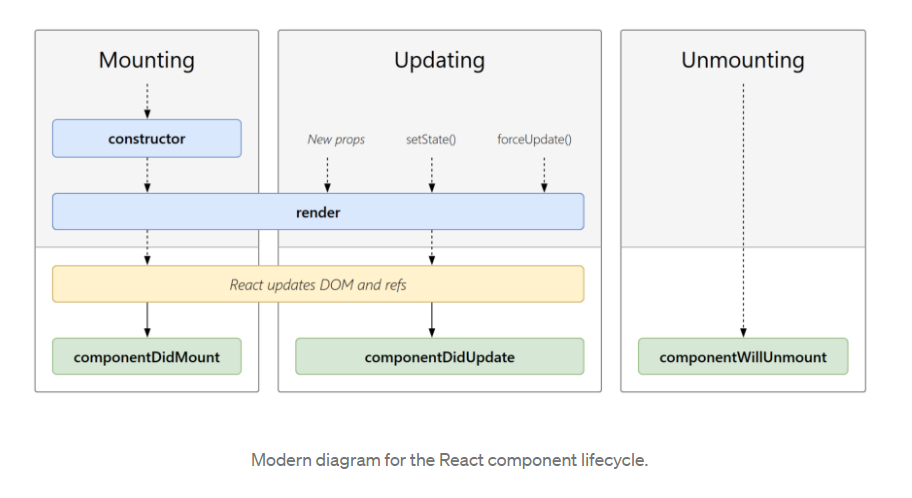

# Learning React essential concepts such as component life cycle, functional vs class component and state management

To have a kick-off for my blog, I will write about some important concepts of react that I learn along the way creating this Portfolio. From the background in Vue JS, the transition to React is pretty smooth for me, but there are some concepts that I had to spend sometime reading and making sure that I understand them. 

The principle which will be mentioned are:
  
* Component life cycle
* Functional vs class components in React
* State management 

## Component life cycle

It is important to understand the basic life cycle of each component because it may be complex when trying to implement animation or change its content through open-source libraries.

The life cycle of any component can be demonstrated in the image below. It is noted that not all components go through all of these stages. They go through 1, 2 or 3 stages.

Life Cycle Diagram (Reference: Karina 2021)

The things need to be remembered here are:
* Everything start with constructor. But setState method cannot be used in constructor. In the constructor, the initial stage will be registered. It also involves with some operation with the props. It happens once in the life cycle.
* The next method will be getDerivedStateFromProps(). This functions is evoked before the render stage. But it is rarely used.
* Render will happen next. Rendering means mounting the components to the DOM. If we need to interact with the component right away after it rendered, using method componentDidMount() Making API is suitable to be used here.
* Updating will have the similar fashion, but it does not have constructor and it has the following methods in order: getDeprivedStateFromProps() -> shouldComponentUpdate() -> render() -> getSnapshotBeforeUpdate() -> componentDidUpdate(). It is noticed that the method shouldComponentUpdate will help us to control whether a component should be updated (by returning false). NextProps and nextState are arguments that can be used for comparison. componentDidUpdated() happens at the end, it receives multiples arguments and it is used to make more fetch requests but these requests should be put in conditional statement.
* Unmounting helps to removed components from the DOM. The method componentWillUnmount() is a way to clean up stuffs before the component is destroyed. 

## Functional vs class components in React

This will discuss about different styles.

How to convert between two styles is important to know.

https://dev.to/bytebodger/constructors-in-functional-components-with-hooks-280m

## State management, Redux

# Reference
Karina Guerra, The Lifecycle of a React Component, Viewed by 30/05/2021, Available at (https://medium.com/codex/the-lifecycle-of-a-react-component-8e01332a068d)

